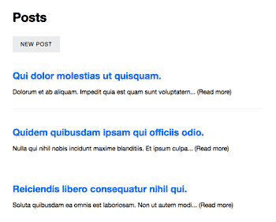

## Rails + Turbolinks 5 + UJS

A simple but fully AJAX blogging app built using Turbolinks 5 and UJS.

- Using Turbolinks 5
- All forms are submitted via AJAX (using remote: true)
- Utilizes Caching (using etags & russian doll caching with cache digests)



##### [Demo](https://serene-ocean-28247.herokuapp.com/)

----------

### Setup

```
git clone http://github.com/bharani91/rails-turbolinks5-blog
cd rails-turbolinks5-blog
bundle install
rake db:create && rake db:migrate
rails server
```

----------

### Running Tests

```
guard
```

---------

[bharanim](http://twitter.com/bharani91)
